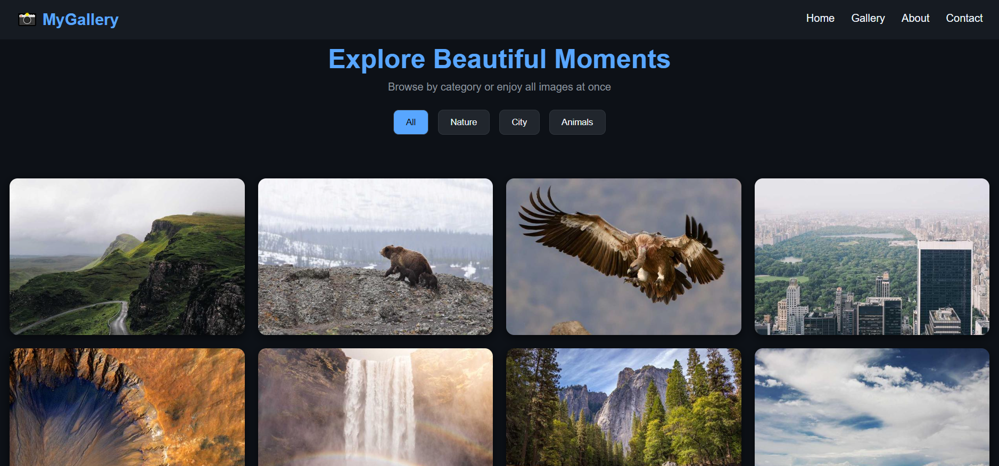
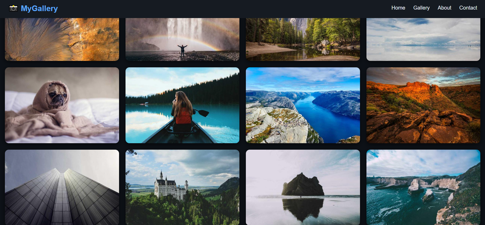
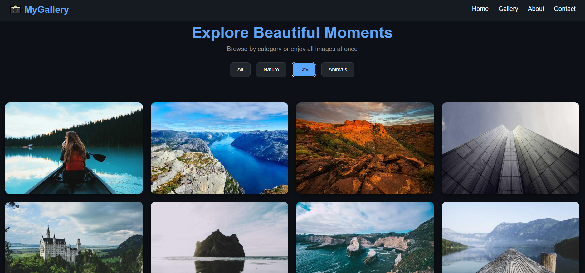
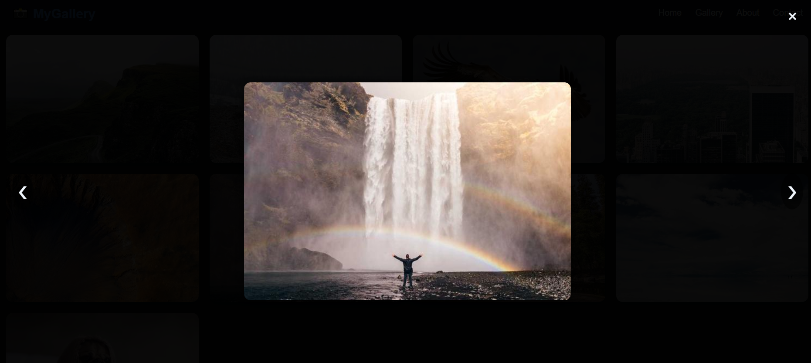

# 📸 Advanced Responsive Image Gallery  

An elegant and responsive **Image Gallery Web App** built with **HTML, CSS, and JavaScript**.  
It features a **modern UI**, **category filtering**, **lightbox view with navigation**, and **smooth hover effects**.  

---

## 🚀 Features  
- 🌐 **Responsive design** (works on desktop, tablet, and mobile).  
- 🖼️ **Grid-based gallery** with auto-fit layout.  
- 🔍 **Category filtering** (Nature, City, Animals, All).  
- 💡 **Lightbox view** with next/previous navigation.  
- 🎨 **Modern dark theme** with smooth hover effects and transitions.  
- 🧭 **Sticky navigation bar** with links.  
- 📱 **Mobile-friendly UI** with adaptive layouts.  

---

## 📸 Screenshots

### Home Page:

---

### Images Section:

---

### City Section:

---

### Slider Section:

---

## 🛠️ Technologies Used  
- **HTML5** → structure  
- **CSS3 (Flexbox & Grid)** → layout and styling  
- **JavaScript (Vanilla JS)** → interactivity (filtering, lightbox, navigation)  

---

## 📂 Folder Structure

/Image-Gallery/
│
├── index.html
├── style.css
├── script.js
├── /images/
│ ├── home.png
│ ├── city section.png
│ ├── slider section.png
└── README.md

---

🤝 Connect with Me:

LinkedIn: www.linkedin.com/in/ayesha-tariq21

---

## 👩‍💻 Author

**Ayesha Tariq**

---

